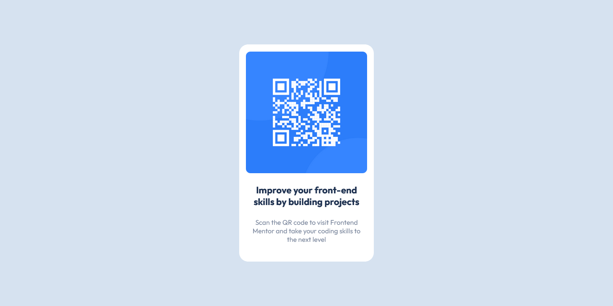

# Frontend Mentor - QR code component solution

This is a solution to the [QR code component challenge on Frontend Mentor](https://www.frontendmentor.io/challenges/qr-code-component-iux_sIO_H). Frontend Mentor challenges help you improve your coding skills by building realistic projects. 

## Table of contents

- [Overview](#overview)
  - [Screenshot](#screenshot)
  - [Links](#links)
- [My process](#my-process)
  - [Built with](#built-with)
  - [What I learned](#what-i-learned)
- [Author](#author)

**Note: Delete this note and update the table of contents based on what sections you keep.**

## Overview

### Screenshot

### Links

- Solution URL: [Add solution URL here](https://your-solution-url.com)
- Live Site URL: [Add live site URL here](https://iamkachi.github.io/qr-code-component/)

## My process

### Built with

- Semantic HTML5 markup
- CSS custom properties
- Flexbox

### What I learned
I learnt how to choose and apply the right units to elements. I also found out through this project that media queries is not the solution to all my problems, though, I'll love to learn it properly😊

## Author

- Website - [IAmKachi](https://www.your-site.com)
- Frontend Mentor - [@IAmKachi](https://www.frontendmentor.io/profile/IAmKachi)
- Twitter - [@MgbejiO](https://www.twitter.com/MgbejiO)
